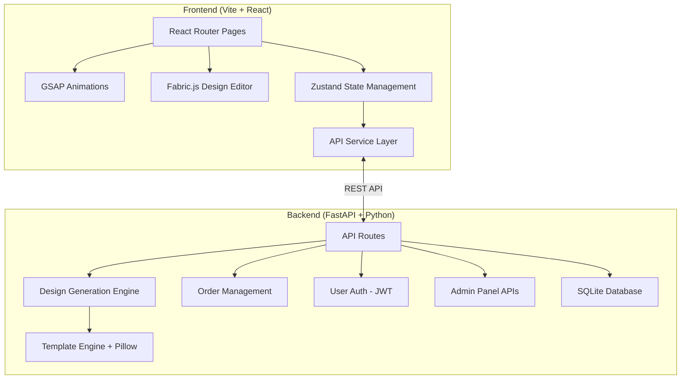
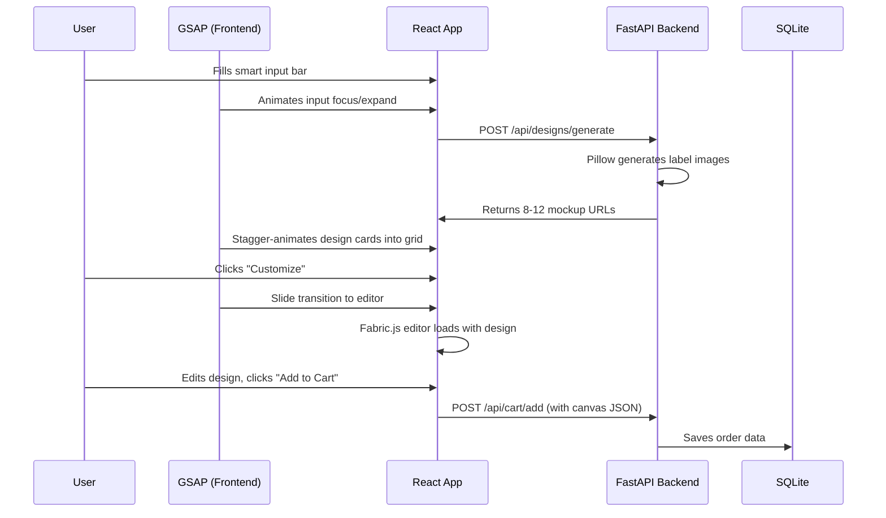

# Vistaar — Custom Water Bottle B2B Platform

A design-driven B2B e-commerce platform where business owners enter simple inputs, get instant AI-generated bottle design options, customize quickly, and order in bulk.

---

## Architecture Overview



---

## GSAP + FastAPI — कहाँ क्या Use होगा (Logical Breakdown)

### 🎬 GSAP (GreenSock Animation Platform) — Frontend Animations

GSAP is used **purely on the frontend** for creating premium, smooth animations that make the site feel alive and professional:

| Where | What GSAP Does | Specific API |
|-------|---------------|-------------|
| **Homepage Hero** | Bottle 3D-like rotation on scroll, text reveal animations, floating elements | `gsap.to()`, `ScrollTrigger`, `gsap.timeline()` |
| **Smart Input Bar** | Expand/focus animation, field stagger reveals, CTA pulse | `gsap.fromTo()`, `stagger` |
| **Design Grid** | Cards fly in with stagger, hover scale/glow effects | `ScrollTrigger.batch()`, `stagger` |
| **Design Editor** | Panel slide transitions, tool selection animations | `gsap.to()`, `Flip` plugin |
| **Page Transitions** | Smooth fade/slide between routes | `gsap.timeline()` with React Router |
| **Micro-interactions** | Button hover effects, loading spinners, success animations | `gsap.to()`, `gsap.fromTo()` |
| **Scroll Storytelling** | "How it works" section with pinned scroll animation | `ScrollTrigger` with `pin: true` |

### ⚡ FastAPI (Python Backend) — Server Logic

FastAPI handles **all business logic, data, and AI design generation**:

| Where | What FastAPI Does | Endpoint |
|-------|------------------|----------|
| **Design Generation** | Takes user input → picks templates → generates label images with Pillow → returns mockups | `POST /api/designs/generate` |
| **Template Management** | Serves pre-built design templates for different business categories | `GET /api/templates` |
| **User Auth** | JWT-based registration, login, token refresh | `POST /api/auth/register`, `/login` |
| **Order Management** | Cart, checkout, order history, pricing calculation | `POST /api/orders`, `GET /api/orders` |
| **Saved Designs** | Save/load user designs (Fabric.js canvas JSON) | `POST /api/designs/save`, `GET /api/designs` |
| **Inquiry System** | Request quote form submission and management | `POST /api/inquiries` |
| **Admin APIs** | Order management, product CRUD, design approval | `GET /api/admin/orders`, etc. |
| **Static Assets** | Serve generated design images and templates | Static file serving |

### 🔗 How They Connect



---

## User Review Required

> [!IMPORTANT]
> **Tech Stack Confirmation**: The plan uses **Vite + React (JavaScript, not TypeScript)** for frontend and **FastAPI + SQLite** for backend. Should I use TypeScript instead? SQLite is simpler for MVP — should I use PostgreSQL instead?

> [!IMPORTANT]
> **AI Design Generation**: Real AI (like DALL-E/Stable Diffusion) integration would require API keys and costs. The plan uses a **template-based approach with Pillow** (Python image library) that composites text, logos, and colors onto pre-designed label templates. This gives instant results without AI API costs. Is this acceptable?

> [!WARNING]
> **Payment Integration**: UPI/Card payments require a payment gateway (Razorpay/Stripe). For the MVP, I'll implement the full checkout UI but use a **mock payment flow**. Real payment gateway can be integrated later with API keys.

---

## Open Questions

1. **Domain/Deployment**: Is this for local development only, or should I set up Docker configs for deployment?
2. **Real Logo Upload**: Should uploaded logos be stored locally or on cloud (S3)? For MVP, I'll use local storage.
3. **Admin Auth**: Should admin use the same login system or a separate admin login? I'll use a role-based approach (user role = "admin").

---

## Proposed Changes

### Project Structure

```
vistaar/
├── backend/                    # FastAPI Python backend
│   ├── app/
│   │   ├── main.py             # FastAPI app entry point
│   │   ├── config.py           # Settings & configuration
│   │   ├── database.py         # SQLite + SQLAlchemy setup
│   │   ├── models.py           # DB models (User, Order, Design, Product)
│   │   ├── schemas.py          # Pydantic request/response schemas
│   │   ├── auth.py             # JWT auth utilities
│   │   ├── routes/
│   │   │   ├── auth.py         # Login/Register endpoints
│   │   │   ├── designs.py      # Design generation & management
│   │   │   ├── orders.py       # Cart & order endpoints
│   │   │   ├── products.py     # Product catalog endpoints
│   │   │   ├── inquiries.py    # Quote request endpoints
│   │   │   └── admin.py        # Admin panel endpoints
│   │   └── services/
│   │       ├── design_engine.py    # Template-based design generator
│   │       └── pricing.py         # Dynamic pricing + bulk discounts
│   ├── templates/              # Pre-built label design templates (PNG/SVG)
│   ├── static/                 # Generated designs, uploaded logos
│   ├── requirements.txt
│   └── seed_data.py            # Initial data seeder
│
├── frontend/                   # Vite + React frontend
│   ├── public/
│   │   └── assets/             # Bottle mockup images, icons
│   ├── src/
│   │   ├── main.jsx            # React entry point
│   │   ├── App.jsx             # Root component + Router
│   │   ├── index.css           # Global design system
│   │   ├── api/
│   │   │   └── client.js       # Axios API service layer
│   │   ├── store/
│   │   │   └── useStore.js     # Zustand global state
│   │   ├── components/
│   │   │   ├── Navbar.jsx
│   │   │   ├── Footer.jsx
│   │   │   ├── HeroSection.jsx     # Smart input bar + hero
│   │   │   ├── DesignGrid.jsx      # Generated designs display
│   │   │   ├── DesignCard.jsx      # Individual design card
│   │   │   ├── DesignEditor.jsx    # Fabric.js 3-panel editor
│   │   │   ├── BottlePreview.jsx   # Live bottle mockup preview
│   │   │   ├── Cart.jsx
│   │   │   ├── OrderHistory.jsx
│   │   │   ├── InquiryForm.jsx
│   │   │   └── AdminDashboard.jsx
│   │   ├── pages/
│   │   │   ├── HomePage.jsx
│   │   │   ├── DesignResultsPage.jsx
│   │   │   ├── EditorPage.jsx
│   │   │   ├── CartPage.jsx
│   │   │   ├── CheckoutPage.jsx
│   │   │   ├── LoginPage.jsx
│   │   │   ├── RegisterPage.jsx
│   │   │   ├── DashboardPage.jsx   # User dashboard (orders, saved designs)
│   │   │   ├── InquiryPage.jsx
│   │   │   └── AdminPage.jsx
│   │   ├── hooks/
│   │   │   ├── useGsapAnimation.js # GSAP animation hooks
│   │   │   └── useAuth.js
│   │   └── utils/
│   │       ├── animations.js       # GSAP animation presets
│   │       └── pricing.js          # Frontend pricing calculator
│   ├── package.json
│   └── vite.config.js
```

---

### Phase 1: Backend Foundation

#### [NEW] [requirements.txt](file:///c:/Users/talre/Downloads/vistaar/backend/requirements.txt)
- FastAPI, uvicorn, SQLAlchemy, Pydantic, python-jose (JWT), passlib, Pillow, python-multipart

#### [NEW] [main.py](file:///c:/Users/talre/Downloads/vistaar/backend/app/main.py)
- FastAPI app with CORS middleware (allow localhost:5173)
- Mount static files directory
- Include all route modules
- Startup event to create DB tables

#### [NEW] [database.py](file:///c:/Users/talre/Downloads/vistaar/backend/app/database.py)
- SQLAlchemy engine + session for SQLite
- Base model class

#### [NEW] [models.py](file:///c:/Users/talre/Downloads/vistaar/backend/app/models.py)
- **User**: id, email, password_hash, business_name, role (user/admin), created_at
- **Product**: id, name, size (250/500/1000ml), base_price, description
- **DesignTemplate**: id, name, category (hotel/restaurant/cafe/event), style, file_path
- **SavedDesign**: id, user_id, name, canvas_json, preview_url, created_at
- **Order**: id, user_id, status, total_price, items (JSON), shipping_address, created_at
- **OrderItem**: id, order_id, product_id, design_json, quantity, unit_price
- **Inquiry**: id, name, business_name, email, phone, quantity, requirements, status

#### [NEW] [design_engine.py](file:///c:/Users/talre/Downloads/vistaar/backend/app/services/design_engine.py)
- Template-based design generation using Pillow
- Takes: business_name, bottle_text, keywords, bottle_size
- Generates 8-12 variations by:
  - Selecting from pre-built label templates
  - Applying different color palettes (based on keywords/industry)
  - Varying typography (font, size, alignment)
  - Compositing text onto label templates
- Returns: list of generated mockup image URLs

---

### Phase 2: Auth & API Routes

#### [NEW] [auth.py](file:///c:/Users/talre/Downloads/vistaar/backend/app/auth.py)
- JWT token creation/verification
- Password hashing with bcrypt
- Auth dependency for protected routes

#### [NEW] [routes/auth.py](file:///c:/Users/talre/Downloads/vistaar/backend/app/routes/auth.py)
- `POST /api/auth/register` — Create user account
- `POST /api/auth/login` — Returns JWT token
- `GET /api/auth/me` — Get current user profile

#### [NEW] [routes/designs.py](file:///c:/Users/talre/Downloads/vistaar/backend/app/routes/designs.py)
- `POST /api/designs/generate` — Generate design mockups (no auth needed)
- `POST /api/designs/save` — Save design (auth required)
- `GET /api/designs` — List saved designs (auth required)
- `GET /api/designs/{id}` — Get specific saved design

#### [NEW] [routes/orders.py](file:///c:/Users/talre/Downloads/vistaar/backend/app/routes/orders.py)
- `POST /api/orders` — Create order
- `GET /api/orders` — List user orders
- `GET /api/orders/{id}` — Get order details
- `POST /api/orders/{id}/reorder` — One-click reorder

#### [NEW] [routes/products.py](file:///c:/Users/talre/Downloads/vistaar/backend/app/routes/products.py)
- `GET /api/products` — List all products with pricing

#### [NEW] [routes/inquiries.py](file:///c:/Users/talre/Downloads/vistaar/backend/app/routes/inquiries.py)
- `POST /api/inquiries` — Submit quote request

#### [NEW] [routes/admin.py](file:///c:/Users/talre/Downloads/vistaar/backend/app/routes/admin.py)
- `GET /api/admin/orders` — List all orders
- `PATCH /api/admin/orders/{id}` — Update order status
- `GET /api/admin/designs` — View all saved designs
- `PATCH /api/admin/designs/{id}/approve` — Approve/reject design
- `CRUD /api/admin/products` — Manage products

---

### Phase 3: Frontend Foundation

#### [NEW] [vite.config.js](file:///c:/Users/talre/Downloads/vistaar/frontend/vite.config.js)
- React plugin
- Proxy `/api` to `localhost:8000`
- Path aliases

#### [NEW] [index.css](file:///c:/Users/talre/Downloads/vistaar/frontend/src/index.css)
- Design system with CSS custom properties:
  - Colors: White + green eco palette, soft neutrals
  - Typography: Google Fonts (Outfit for headings, Inter for body)
  - Spacing scale, border-radius tokens
  - Glassmorphism utilities
  - Smooth transition defaults
  - Mobile-first responsive breakpoints

#### [NEW] [App.jsx](file:///c:/Users/talre/Downloads/vistaar/frontend/src/App.jsx)
- React Router with routes for all pages
- Layout wrapper with Navbar + Footer
- GSAP page transition animations

#### [NEW] [useStore.js](file:///c:/Users/talre/Downloads/vistaar/frontend/src/store/useStore.js)
- Zustand store managing:
  - User auth state
  - Cart items
  - Current design data
  - Generated designs list

---

### Phase 4: Homepage & Design Generation

#### [NEW] [HeroSection.jsx](file:///c:/Users/talre/Downloads/vistaar/frontend/src/components/HeroSection.jsx)
- Hero with animated heading + subheading (GSAP text reveal)
- **Smart Input Bar**: business name, bottle text, keywords, size dropdown, quantity
- Animated bottle mockup floating/rotating with GSAP
- "Generate Design" CTA with pulse animation
- ScrollTrigger for "How it Works" section below

#### [NEW] [DesignGrid.jsx](file:///c:/Users/talre/Downloads/vistaar/frontend/src/components/DesignGrid.jsx)
- Receives generated designs from API
- Renders 8-12 DesignCards in responsive grid
- GSAP `ScrollTrigger.batch()` for staggered card entry
- Filter/sort options

#### [NEW] [DesignCard.jsx](file:///c:/Users/talre/Downloads/vistaar/frontend/src/components/DesignCard.jsx)
- Design preview image
- Label style name + color info
- "Customize" button → navigates to Editor
- "Quick Order" button → adds to cart directly
- GSAP hover scale + shadow animation

---

### Phase 5: Design Editor (Core Feature)

#### [NEW] [DesignEditor.jsx](file:///c:/Users/talre/Downloads/vistaar/frontend/src/components/DesignEditor.jsx)
- **Three-panel layout**:
  - **Left Panel**: Bottle size selector, quantity input, template browser
  - **Center**: Fabric.js canvas with live label preview
  - **Right Panel**: Text editor, color picker, logo upload, label position adjust
- Fabric.js canvas features:
  - Add/edit text objects (font, size, color, position)
  - Upload and place logos (drag, resize, rotate)
  - Color palette selector for label background
  - Template switching
  - Undo/Redo support
- "Save Design" button
- "Add to Cart" button
- GSAP panel slide animations on tool selection

#### [NEW] [BottlePreview.jsx](file:///c:/Users/talre/Downloads/vistaar/frontend/src/components/BottlePreview.jsx)
- CSS 3D transform-based bottle mockup
- Overlays the Fabric.js canvas export as the label
- Real-time updates as user edits

---

### Phase 6: Cart, Checkout & Orders

#### [NEW] [Cart.jsx](file:///c:/Users/talre/Downloads/vistaar/frontend/src/components/Cart.jsx) & [CartPage.jsx](file:///c:/Users/talre/Downloads/vistaar/frontend/src/pages/CartPage.jsx)
- Cart items with design preview thumbnails
- Dynamic pricing display
- Bulk discount tiers shown
- Quantity adjustment
- "Request Quote" for large orders

#### [NEW] [CheckoutPage.jsx](file:///c:/Users/talre/Downloads/vistaar/frontend/src/pages/CheckoutPage.jsx)
- Shipping/billing address form
- Order summary
- Mock payment flow (UPI/Card selection)
- Order confirmation with GSAP success animation

#### [NEW] [DashboardPage.jsx](file:///c:/Users/talre/Downloads/vistaar/frontend/src/pages/DashboardPage.jsx)
- Order history with status tracking
- Saved designs library with thumbnails
- "Reorder" button on past orders

---

### Phase 7: Admin Panel

#### [NEW] [AdminPage.jsx](file:///c:/Users/talre/Downloads/vistaar/frontend/src/pages/AdminPage.jsx) & [AdminDashboard.jsx](file:///c:/Users/talre/Downloads/vistaar/frontend/src/components/AdminDashboard.jsx)
- Tab-based layout:
  - **Orders**: Table with status, actions (approve/ship/complete)
  - **Products**: CRUD for sizes and pricing
  - **Designs**: View submitted designs, approve/reject
  - **Inquiries**: View and respond to quote requests
- Simple, functional design (no complex analytics)

---

### Phase 8: Polish & Animations

#### [NEW] [animations.js](file:///c:/Users/talre/Downloads/vistaar/frontend/src/utils/animations.js)
- Reusable GSAP animation presets:
  - `fadeInUp()` — for section reveals
  - `staggerCards()` — for grid items
  - `heroAnimation()` — complex hero timeline
  - `pageTransition()` — route change animations
  - `bottleFloat()` — continuous floating bottle effect
  - `pulseButton()` — CTA attention animation

---

## Execution Order

| Phase | What | Est. Files |
|-------|------|-----------|
| **1** | Backend foundation (DB, models, design engine) | 7 files |
| **2** | Auth + all API routes | 7 files |
| **3** | Frontend foundation (Vite setup, CSS, routing, store) | 6 files |
| **4** | Homepage + design generation flow | 5 files |
| **5** | Design editor with Fabric.js | 3 files |
| **6** | Cart, checkout, orders, dashboard | 5 files |
| **7** | Admin panel | 2 files |
| **8** | GSAP polish + responsive fixes | 2 files |

**Total: ~37 files across 8 phases**

---

## Verification Plan

### Automated Tests
1. Start backend: `cd backend && uvicorn app.main:app --reload`
2. Start frontend: `cd frontend && npm run dev`
3. Test API endpoints with browser/curl
4. Verify design generation produces valid images
5. Test full user flow in browser

### Browser Testing
- Homepage loads with animations
- Smart input bar works → generates designs
- Design grid displays mockups
- Editor opens with Fabric.js canvas
- Cart/checkout flow completes
- Admin panel functions
- Mobile responsive at all breakpoints

### Manual Verification
- Visual quality of GSAP animations
- Design generation quality (label readability, color harmony)
- Editor usability (drag/drop, text editing)
- Overall UX flow smoothness
